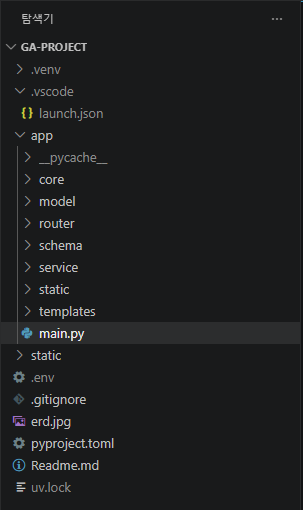
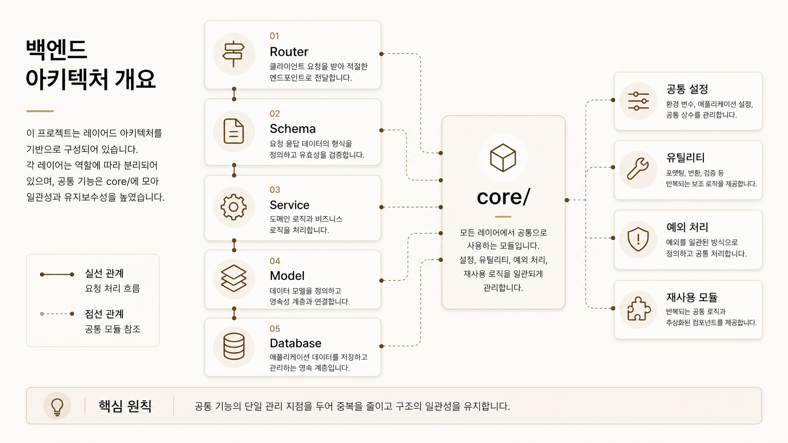
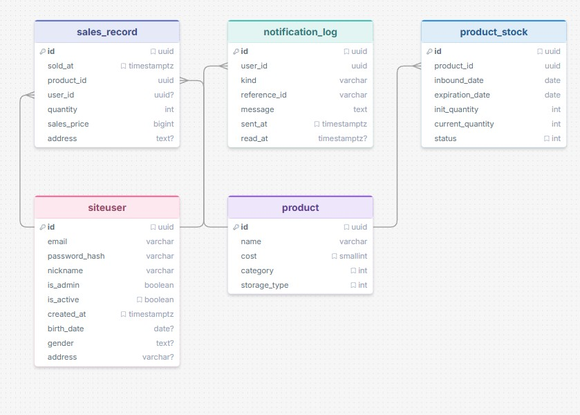

# 🚀 FastAPI Project

FastAPI + Jinja2 템플릿 기반의 웹 애플리케이션입니다.  
JWT 인증, 비동기 DB 연동, 서비스 레이어 분리 구조로 설계되었습니다.

---

## 📁 프로젝트 구조

```
app/
├── core/                   # 공통 핵심 모듈
├── model/                  # SQLAlchemy ORM 모델
├── schema/                 # Pydantic 스키마 (요청/응답 검증)
├── service/                # 비즈니스 로직 레이어
├── router/                 # FastAPI 라우터 (엔드포인트 정의)
├── static/                 # 정적 파일 (CSS, JS, 이미지)
├── templates/              # Jinja2 HTML 템플릿
└── main.py                 # 앱 진입점 (FastAPI 인스턴스, 라우터 등록) 
```



---

## 🏛️ 아키텍처 개요

이 프로젝트는 **레이어드 아키텍처(Layered Architecture)** 를 따릅니다.

```
Request
  │
  ▼
[Router]       ← HTTP 요청 수신, 파라미터 파싱, 응답 반환
  │
  ▼
[Schema]       ← Pydantic으로 입력 데이터 유효성 검증
  │
  ▼
[Service]      ← 비즈니스 로직 처리
  │
  ▼
[Model]        ← SQLAlchemy ORM을 통해 DB 접근
  │
  ▼
[Database]     ← 실제 DB (Supabase)
```

**`core/`** 는 모든 레이어에서 공통으로 사용하는 모듈입니다.



---

## 🏛️ ERD



---

## ⚙️ 기술 스택

| 분류 | 기술                   |
|------|----------------------|
| 웹 프레임워크 | FastAPI              |
| 템플릿 엔진 | Jinja2               |
| ORM | SQLAlchemy (Async)   |
| 인증 | JWT (JSON Web Token) |
| 데이터 검증 | Pydantic v2          |
| 데이터베이스 | Supabase(PostgreSQL) |

---

## 🔐 인증 방식

JWT 기반 인증을 사용합니다. `core/auth.py`에 토큰 생성 및 검증 로직이 구현되어 있으며, 보호된 엔드포인트는 `Authorization: Bearer <token>` 헤더를 요구합니다.

---

## 📌 네이밍 컨벤션

도메인별로 router / schema / service 파일을 동일한 접두사로 묶습니다.

```
user_router.py  /  user_schema.py  /  user_service.py
product_router.py  /  product_schema.py  /  product_service.py
cart_router.py  /  cart_schema.py  /  cart_service.py
```
